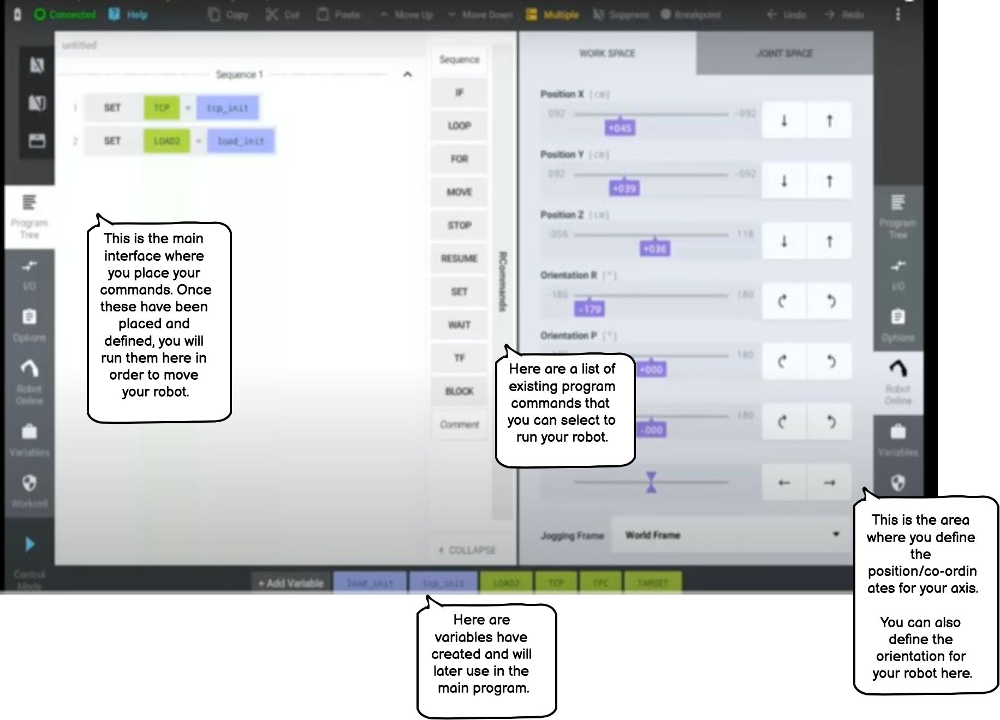

# Manual for the Grid Pattern Structure

## Introduction

The following is a short tutorial that demonstrates how to use the Grid Pattern structure in the robot interface. This is the basic mechanism that teaches the robot how to move.

This tutorial comprises of the following three sections:

## Table of Contents
1. [What is the Grid Pattern Structure?](#what-is-the-grid-pattern-structure)
2. [How to Use the Interface](#how-to-use-the-interface)
3. [How to Use The Grid Pattern Structure](#how-to-use-the-grid-pattern-structure)
    - [Definitions](#definitions)
    - [Summary](#summary)
    - [Step 1: Single line grid pattern](#step-1:-single-line-grid-pattern)
    - [Step 2: 4x6 Grid pattern](#step-2:-4x6-grid-pattern)
    

### What is the Grid Pattern Structure?

