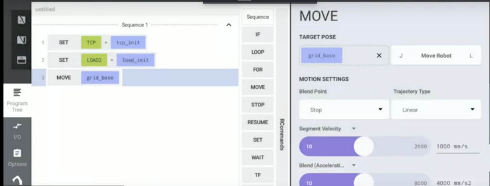
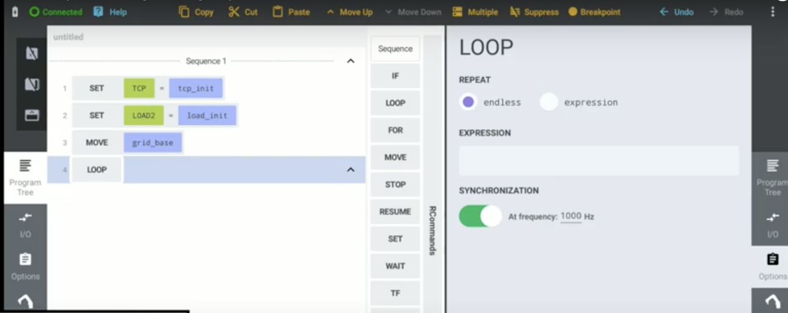
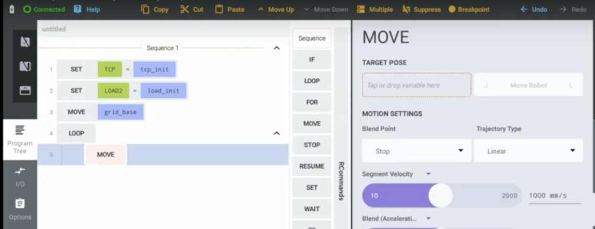
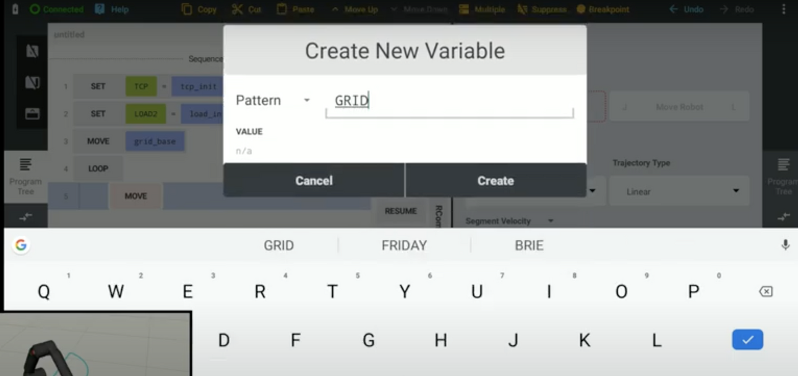
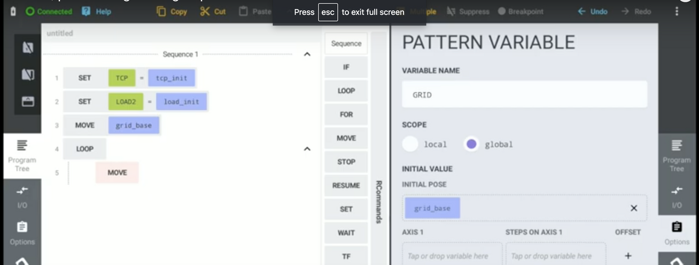
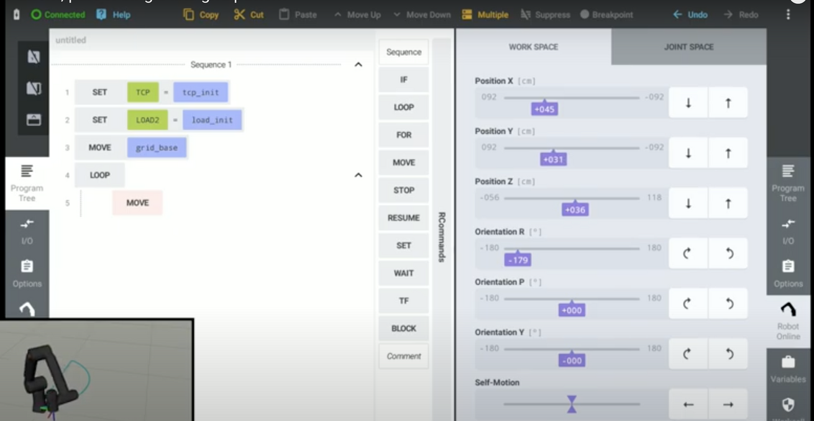
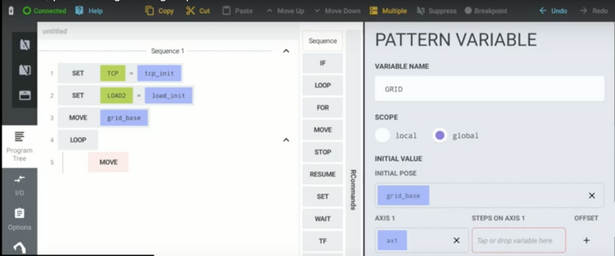
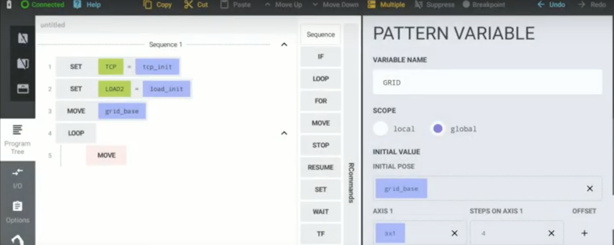
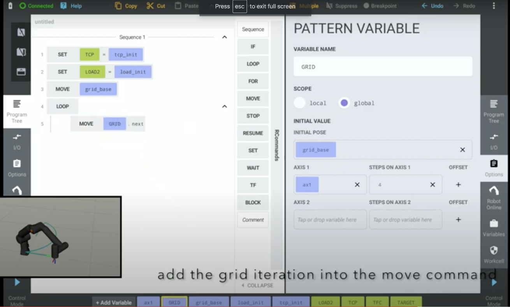
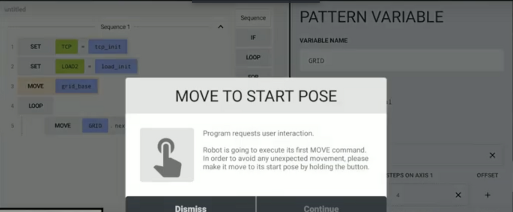

# Manual for the Grid Pattern Structure

## Introduction

The following is a short tutorial that demonstrates how to use the Grid Pattern structure in the robot interface. This is the basic mechanism that teaches the robot how to move.

This tutorial comprises of the following three sections:

## Table of Contents
1. [What is the Grid Pattern Structure?](#what-is-the-grid-pattern-structure)
2. [How to Use the Interface](#how-to-use-the-interface)
3. [How to Use The Grid Pattern Structure](#how-to-use-the-grid-pattern-structure)
    - [Definitions](#definitions)
    - [Summary](#summary)
    - [Step 1: Single line grid pattern](#step-1:-single-line-grid-pattern)
    - [Step 2: 4x6 Grid pattern](#step-2:-4x6-grid-pattern)
    

### What is the Grid Pattern Structure?

### How to Use the Interface

As you can see, the main screen comprises of two main sections. The section on the left is where you place all your commands and run the program.

The section on the right is where you provide more detail for each command, parameter and variable that you create. Examples of details include the the type of axis being used (x, y or z), the position of the axis, its orientation and the number of points.

The variables are placed at the bottom of the screen, and you can drag them at any point into the main program. There is also a list of existing commands as identified in the diagram that are custom-built into the program and can be modified in the section on the right.

### How to Use the Grid Pattern Structure

### Definitions

**Pattern** : 

**Pose** :

### Summary

In the following few sections, we will identify how to map out the following points:

Firstly, we will identify how to create a single line grid pattern structure.

We can then build on this structure and create a 4x6 movement for the robot.

Finally, we can add pickup moves to the robot relative to the recent target pose defined in the first two images.

### Step 1

**Single line grid pattern structure**

In Step 1, we are defining a 1 axis grid. This will provide a base for the rest of our grid pattern structure.

- Firstly, we place the MOVE command into the main program tree. 

- Then, we define our initial target pose as a new variable. We are naming this 'grid_base' as it will be the base and starting point for the rest of our robot's interaction. 

- As you can see in the image below, the target pose has now been configured to 'grid_base' and we have added it to the main program tree.

- In this particular example, we want our robot to repeat the movement we have created unless otherwise specified.

- To achieve this, we have used our pre-existing loop command. On the right side of the screen, we have defined this loop as 'endless'.

- Now that the base for our movement has been set-up, we can start to create the Pattern for how we want our robot to move. To do this we add another MOVE into our loop like so:

- Then, we define our Pattern, making sure to change 'Pose' into 'Pattern' on our left. We are naming this Pattern 'GRID'.

- It is necessary then to add our existing 'grid_base' to the initial pose section for our GRID variable, as this will create a starting point for our single line axis.

- Now that our pattern has been created, we need to move the position of the robot on the grid's edge.

- Then we set our first axis point under axis 1 on the right hand side of the page:

- And define how many points are on the axis under Steps on Axis 1 . In this example, we are creating 4.

- Now that we have created our GRID iteration, we pull it from our variables at the bottom and add it to our program next to the MOVE command in our loop.

Everything is now setup. The program will then alert you to move to the start pose if you haven't already done so, like so:

Your robot should now successfully move along a single line axis.

